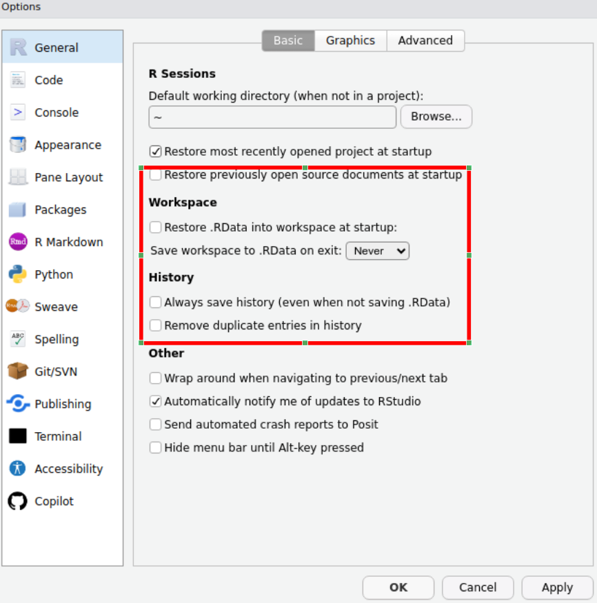

```{r setup, include=FALSE, warning = FALSE, message = FALSE}
knitr::opts_chunk$set(echo = TRUE)
library(dplyr)
library(flextable)
library(mosaic)
```

Try to complete sections 1 to 10 of this introductory practical. Some sections are mainly reading material, so should not take too long. Please ask Demonstrators or Staff during the practical if you have any problems.

# Aims and objectives of Practical 0

The overall aim of this practical is to help you become more familiar with RStudio, what its main panels are for, how to download data from Canvas, and import it into R.
Specific objectives include:

1.  explain the concept of RStudio projects to allow you to store data, files containing R commands (known as scripts), and the four main panels in RStudio
2.  demonstrate the value of .csv files (comma separated files) as these can be read / written by both R and Microsoft Excel, and the functions to do this.
3.  understand free R packages to extend the power of R. How to install and load packages for use.
4.  how to calculate simple summary statistics of the data you have imported into R

## R vs RStudio

R is the basic underlying computer software you use to undertake analyses of biological data.
RStudio is a separate programme that creates an "Integrated Development Environment" (IDE) that makes it easier to do data science.
Think of the differences between doing arithmetic on a hand-calculator vs Microsoft Excel.
RStudio defaults to automatically uses R, but can handle other computer languages such as C++, HTML and Python.

## Starting RStudio

Campus computers have the software installed and NES2504 assumes you will be using an NUIT-managed PC. Both R and RStudio are free download from [download the R software](https://cran.r-project.org/) and [Download the R Studio desktop software](https://rstudio.com/products/rstudio/#rstudio-desktop) respectively.
However, if you run it on your own laptop or MacBook we **will not provide you with any technical support** as there is too much variation between operating systems, PC configuration etc.
When attending practicals you will ONLY get help for using an NUIT machine.

You should have a 'search' bar at the bottom left of your NUIT Windows PC, labelled *Type here to search*.
In it type ***RStudio*** and the launch icon should be displayed for you to click on:

```{r, echo = FALSE}
knitr::include_graphics("images/start_from_windows_menu.png")
```

(If you do not have a search bar, click on the Windows icon, navigate to *Programming and Databases* or *RStudio* and click on the *RStudio* icon. Do **not** click on the icon labelled *R i386* or *R x64* )

**IMPORTANT**: If a popup window appears when you start RStudio click "Ignore Update"

Once RStudio has started up you can get to work.

# Modify RStudio default settings

On opening R Studio you should see something like this

```{r, echo = FALSE}
knitr::include_graphics("images/Rstudiofresh.png")
```

Unfortunately RStudio has a number of default settings which from past experience is confusing for students.
If you suffer from dyslexia or have poor eyesight there are several other settings you may want to change.

## Startup and close defaults

By default RStudio tries to re-open everything you last worked with (even if you are analysing new data), prompts you to store data (even when you have it stored already) etc.
Let's switch off those annoying defaults.
From the main menu click on **Tools -\> Global options**

```{r, echo = FALSE}
knitr::include_graphics("images/tools_global.png")
```

Make sure that the following boxes are **unticked** or changed (see below):

- Restore previously opened source files at startup
- Restore .RData into workspace at startup
- Save workspace to .RData on exit. **Change to never**
- Always save history (even when not saving .RData)
- Remove duplicate entries in history

Click on 'OK' once you have done this.

```{r, echo = FALSE}
library(knitr)
knit_hooks$set(optipng = hook_optipng)

```

## Change appearance (optional)

If like me you have poor eyesight, or e.g. have dyslexia and find some fonts difficult to read, you can modify the RStudio appearance.
Again click on **Tools -\> Global options** but click on the **Appearance** icon on the left.
You should see something similar to below:

```{r, echo = FALSE}
knitr::include_graphics("images/appearance.png")
```

The default 'Editor theme' appearance is called Textmate, which I find rather harsh on the eyes.
Preview other appearance options by clicking on them (personally I like the 'Tomorrow Night bright' theme which has a black background).
You can also change the font size to make it bigger, or the Zoom ratio.

**Next week**: Unfortunately the NUIT computers can be unreliable in retaining user settings.
If possible, try to use the same computer next week and there is a higher chance of these settings being retained.
This is not an issue on personal laptops or MacBooks.

# R packages

A package is an additional 'plug-in' for R that can extend its capabilities.
When R was originally created there were only about 10 add-on packages, but now there are over 20,000.
This is one of the reasons why it is so popular amongst scientists: it is easy to adapt, modify and improve.
Here are some of the things I've seen people use packages for:

- create maps of satellite data
- analyse GPS animal movement data
- visualise genome sequences
- analyse next-generation sequence MinIon data
- create phylogenetic trees
- plot citizen science species records
- model flood risk
- artificial intelligence on wildlife camera trap
- analyse songbird audio
- model disease spread in humans and wildlife
- scrape data from Twitter for 'sentiment' analysis
- write books and reports
- create websites

Packages are hosted on the Comprehensive R Archive or CRAN.
As there are now so many R packages they have been organised into [Task Views](https://cran.r-project.org/web/views/) on CRAN to help you navigate them.

## How to install and activate a package from CRAN (**Only needed for your own laptop**)

Using a package is a 2-step process:

- Install a package. This downloads software from the internet onto your computer. **It only has to be done once**. If you use NUIT cluster room PCs the packages you need for NES2504 should already be available so you can skip this step. Use `install.packages("package_name")` to install a package.
- Activate a package. This makes the extra R commands available for you to use. **It has to be done every time you use R**. Use the command `library(package_name)` to activate a package.

A common mistake is to forget to use the `library()` command.
I try to remember to use it first in any R session.

## Installing the R packages needed for NES2504 (**Only needed on your own laptop**)

NUIT clusters should have the key packages installed, so you should be able to skip this step.
You need three R packages installed initially for this module.
You should only need to do the installation once on an NUIT networked PC.
The three packages are:

- `mosaic` : this does a goal-oriented approach for plots and models
- `car` : this makes the output of some analyses easier to understand
- `tidyr` : useful for tidying up date

**Console** which will contain introductory text about the R version you are usin etc.
On my PC it shows as version 4.0.2 but you may have a more recent version:

```{r, echo = FALSE}
knitr::include_graphics("images/R_console_initial.png")
```

**Do NOT do the following if using an NUIT machine. ONLY needed on your own laptop.**

ONLY if using your own laptop: install `mosaic`, `car`, `tidyr` by typing the text below into the Console followed by the Enter key:

```{r, eval=FALSE}
install.packages("mosaic")
install.packages("car")
install.packages("tidyr")
```

Normally lots of output is generated as packages are downloaded from the internet and stored on your computer.
You will often see other packages being installed at the same time.
This is nothing to worry about.

## Activating an R package (**Needed for every practical on both NUIT and personal laptops**)

Use the `library()` function to activate an R package.
Installing an R package simply puts the extra software on your PC, but it does not make it available for use.
This is because you may have many packages eventually installed, that might have commands with identical names but which do different things.
To take a simple example, in some packages the `plot` command will create a map, whereas in other packages it might display a genome phylogeny, and you would not want to confuse them.
Therefore, in any R session you generally only make available the packages you need.
To make the commands from a package available to use, enter the `library` command followed by the package name, for exampe (you don't need to do this now):

```{r, eval=FALSE}
library(mosaic)
library(car)
library(tidyr)
```

# RStudio projects

An RStudio project is a special folder where you can safely keep all the commands for your analyses and your data files together.
I generally create a separate RStudio project folder for each experiment or survey that I am involved in.

## Create an RStudio project (Just needed once in this first practical)

We are going to start by creating an RStudio Project called 'NES2504' to keep all of our work relating to the 'NES2504' Data Analysis course together in one place.
Later in your degree you will want to create new RStudio projects for other experiments or work.

To create a new project click on the main menu on `File` \> `New Project`\
You should now see this popup window, on which you should select **New directory**

```{r, echo = FALSE}
knitr::include_graphics("http://www.rstudio.com/images/docs/projects_new.png")
```

then a **Project Type** window like the following should appear, from which you should select **New Project**:


Finally, the following window, entitled **Create New Project** should appear:


In this window complete two sections:

- The **Directory name**. This is the name of the folder to store your files containing records of your analyses and your data . For convenience, call it **NES2504**.
- The section **Create project as subdirectory of:** Click on the **Browse** button and navigate to you **OneDrive** folder. This will typically be called "OneDrive - Newcastle University" with a blue Cloud icon. You should store all your folders and files here so they are backed up.

Finally, click on the **Create project** button at the bottom and you should now see the name of your project displayed in the top right hand side of your R Studio window.

## How to start RStudio with your project (all future practicals in NES2504)

Once you have created a project, all you need to do in is:

- Start RStudio
- It should automatically open your NES2504 project. If not, then: Click on **File -\> Recent projects...** and select **NES2504** from the list

# Navigating RStudio

In the top left click `file` \> `new file` \> `R script` and now you should have four windows that look something like this:

```{r, echo = FALSE}
knitr::include_graphics("images/Rstudio4packages.png")

```

You should now have Four panes in your R Studio window, you might notice that some of them have multiple tabs as well.
Let's run through the meaning of each of the panes, and the tabs that we are going to be using:

## Scripts

The pane in the **top left** contains your scripts.
A script is a plain text file that should be saved with the extension `.R` and it contains a list of all the commands you use to import, summarise, display, analyse, plot or export data.

One of the key reasons that R is so popular is because it allows us to make our work reproducible.
By writing down each bit of our analysis and saving it in a script we can reproduce our work with ease.
Future you will thank past you for saving your code in scripts when you are making last minute edits to your dissertation and you need to remember exactly what the analysis methods you used were!

## Environment

The pane in the **top right** has a couple of tabs but the one that we need to know about is the Environment tab.
The Environment pane tells us what objects R has loaded in to its memory (we'll touch on this a bit more later on), these might be data files that we have imported or the results of some analyses.
This pane shows us the objects that R has available for doing useful stuff.

## Console

The pane in the **bottom left** also has several tabs and the one that we use is called the console.
This pane is the 'doing pane' when we want to run bits of code that we have saved in our script we send them to the console to be executed - which means R does what our code tells it to do and we get some output.
You have already directly typed commands into the Console to setup some intial packages.
In future **strongly advise against doing this**, it is much better to write your code in a script that you can save and come back to for future reference.

## Files/Plots/Packages

**Bottom right pane** has several tabs that give the pane different functions that can be of use.

The ***Files*** tab can be used a bit like windows explorer/finder to navigate through the files on your computer.

```{r, fig.cap = " Here the files tab shows us that within the folder that we are working in there are several different files associated with the module handbook as well as a folder of images", echo = FALSE}
knitr::include_graphics("images/Rstudio4files.png")
```

The ***Plots*** tab is where the plots that you create using the code written in your script will appear.
It has an export button that you can use to save your plots or to copy them to your clipboard so that you can then insert them into documents or presentations.

The ***Packages*** tab shows you the packages that are installed on your computer, the ones with ticks in the boxes are ones that are loaded and ready for you to use.
Packages are collections of code and/or data that other people have written that we can use.
Packages mostly contain bits of code called *functions* which we will cover in a bit more depth in the 'working with data' section.

The ***Help*** tab offers you an interactive window through which you can use the help files for R functions.
You can use the search bar at the top of the pane to search for the help files associated with a given package or function.
We will cover the help files in more detail once we have got a bit more of an understanding of some of the R lingo

```{r, echo = FALSE}
knitr::include_graphics("images/Rstudio4help.png")
```

**Think of R as your Kitchen**

Using R can be thought of similar to using a kitchen to cook.

```{r, fig.align='center', echo = FALSE}
knitr::include_graphics("images/Rkitchen.png")
```

There are loads of really great chefs (coders) in the world who have already figured out a lot of techniques and gadgets that can be used to make some great food.
You don't always have to cook everything from scratch - you can use the information and tools that other people have provided to make your cooking experience easier and more enjoyable.

# Download files from Canvas and import data

In NES2504 all of the data will be provided for you on Canvas for import into R.
When you work independently, you will probably be entering data in Microsoft Excel.
Either way there are a couple of '**gotchas**' to look out for.
Download the Excel File `yield.xlsx` from Canvas - you can open it in Excel and look at it, but don't edit it or make any changes to it.
The file contains crop growth in three different soil types.

Now, in your Script window (top left) type the following text.
Note the use of both comments, which are prefixed by `#`, and blank lines to make the text more readable.
Just as you use headings and paragraphs to make an essay easier to read, use `#` and blank lines to make your R script easier to understand:

```{r, eval=FALSE}
library(mosaic)
pract0_dat<-read.csv("yield.csv")
summary(pract0_dat)
mean(yield~soil,data=pract0_dat)
```

A few key points:

- Line 1: Whenever you start RStudio you will need to activate the relevant packages, so `library(mosaic)` ensures we can use extra functions
- Lines 2 to 4: Some R functions to read in your data file and save it in a temporary table within R called `pract0_dat`, produce a summary and display averages.
- But **it is really hard to understand**! Imagine **iftextiswrittenlikethis** then it would be hard to understand. Whereas **if text is written like this** it now makes sense. So we will add spaces, blank lines and **Comments**. A comment is anything that follows the `#` symbol and is ignored by R, but helps you understand what you have done. So before going further, edit your script to make it more readable, with comment lines, blank lines, and a space around the `<-` symbol, and in the `mean` line:

```{r, eval=FALSE}
# Practical 0: Revision and R basics

# Activate the mosaic package so extra commands available
library(mosaic)

# Import crop yields for different soils into a table pract0_dat
pract0_dat <- read.csv("yield.csv")

# Print out a summary of the data held in pract0_dat
summary(pract0_dat)

# Obtain the mean yield for each soil type
mean(yield ~ soil, data = pract0_dat)
```

Now save your R script.
Click on **File -\> Save** from the RStudio main menu, or if you prefer the save icon, and save the script as `practical0.R`.
Next run each line of your script.
Click on the `library(mosaic)` line and hit the **Ctl-Shift-Enter** keys simultaneously.
This key combination sends a line from your script to the Console window where it is executed.
The command should run without displaying anything as `mosaic` is probably already activated.
Your cursor should jump to the `read.csv` line.

However, when you hit Ctl-Shift-Enter on the `read.csv` line you should get the following error:


What has gone wrong?
We've just downloaded the file from Canvas yet R claims it is missing?
The problem is that when you downloaded the data file from Canvas, it placed it into your **Downloads** folder.
You need to move it to the **NES2504** folder, that already contains your project settings file, and your `practical0.R` file:

- Start up the File Manager either from the main Windows menu, or by entering "File Manager" in the search bar
- Navigate to your Downloads folder
- Locate the `yield` file in your Downloads folder
- Right-click on your `yield` file and select **Copy**
- Navigate to your NES2504 folder, Right-click and select **Paste**
- Go back to RStudio, and in the Files tab (bottom right) click on the "refresh" button (a small circular arrow on the right of the files tab). You should see the `yield` file listed.

Now go back to your R script and try re-running the `read.csv` command by clicking on the line, and hitting the Ctrl-Shift-Enter key combination again.
BUT **it does not work**.
You get the same error message!!
Why??

This is such a common error, that I thought it worth emphasising it.
Some of you may even have already worked out what has gone wrong.
The clue is in the name of the command `read.csv` which is to read a CSV file.
What is this:

- CSV stands for "comma separated value" and is a plain text, simple file, that can be read by hundreds of different programs and apps
- A standard Microsoft Excel file is a commercial-format file, that can be imported by a more limited range of software. It is much more complex as it can contain multiple tables, forumlae, graphs etc.

So, finally we need to convert our Microsoft Excel file.
Go back to your File Manager, navigate to the NES2504 folder (it might already be open) and double-click on the `yield` file to open it in Microsoft Excel.
Then click on the **File -\> Save As** option, and in the drop-box below the filename, select the CSV option:


Now close Excel; you may get a warning claiming you haven't saved your file (you have!), but Microsoft gets cross if you don't use its commercial file formats.
Go back to your File Manager and you should see something similar to this:


There are four files listed, although the default settings in File Manager does not give their full names (last few letters are omitted) which can cause confusion

- `NES2504` which is actually `NES2504.RProj` and contains your RStudio project settings
- `practical0` which is actually `practical0.R` and contains your script with R commands
- `yield` which is `yield.csv` in Comma Separated Value format
- `yield` which is `yield.xlsx` in Microsoft Excel format

Look very carefully and you can see that the icons for the two yield files are slightly different, as one has **,a** in it.
You can change the settings in File Manager so that full file names with the final "extension" are showing.
For the bulk of the NES2504 course all the files will be CSV format, so you will not have this problem.
But sometimes data will be in Excel format so it is essential you know how to convert to CSV.

Go back to RStudio.
Now you should be able to re-run your `read.csv` line.
If it is successful, nothing will be displayed in the console, but in your Environment window (top right panel) you should see the table (data frame) `pract0_dat` listed, and when you run the `summary(pract0_dat)` and `mean(yield ~ soil, data = pract0_dat)` commands you should see:

```{r, echo = FALSE, eval = TRUE}
# Import crop yields for different soils into a table pract0_dat
pract0_dat <- read.csv("Data/yield.csv")

# Print out a summary of the data held in pract0_dat
summary(pract0_dat)

# Obtain the mean yield for each soil type
mean(yield ~ soil, data = pract0_dat)
```

Success!
Please let myself or one of the demonstrators know if you have problems with this step.

**Where to store your CSV files?**

You can store them either in your main project folder.
Sometimes if you have lots of data files this can get confusing, so I generally recommend creating a folder called **`Data`** inside your `NES2504` project folder, and putting your CSV files there.
The only difference is you need to change the `read.csv` command from:

`pract0_dat <- read.csv("yield.csv")`

to

`pract0_dat <- read.csv("Data/yield.csv")`

My preference (and recommendation to you) is to put all your CSV files into a `Data` subfolder in your `NES2504` folder, in which case you'll need to remember to add `Data/` to any `read.csv` commands.
That way your NES2404 folder is less likely to get cluttered as you go through the module.
Do this now:

- Open your Windows File Manager again (it might still be open), and inside your NES2504 folder create a new folder called 'Data'.
- Move (click and drag) your two `yield` files (.xlsx and .csv) into your Data folder
- Go back to RStudio and in your `practical0.R` script change the `read.csv` line to include the `Data` prefix as shown above. Run the code again to be sure it all works.

# Working with data

## Using R as a calculator

You probably won't use this very often, but you can easily enter values into the **Console** window if you need to do some quick arithmetic:

```{r, eval=FALSE}
7 * 3
log(24)
4^2
7 / 3
pi * 3 ^ 2
```

As you have typed the above into the Console window it isn't saved after you finish today's practical, but it doesn't matter for some quick temporary calculations. Individual numbers, columns, rows, or tables of data, the results from calculations, statistical analyses and graphs are all **R objects** and the ones you have created in your current RStudio are shown in the top right **Environment** panel.

As mentioned before R is a programming language, as with any language there is some vocab that needs to be covered in order to help your understanding of what is being described.

## Creating Objects

Although you have done some arithmetic above, it is much more useful to **assign** the results to an R object, so you can re-use them later.
You do this using the assignment symbol `<-` which looks like a left arrow.
If you are having trouble finding the `<` and `-` keys, a handy shortcut is to press

typing <kbd>Alt</kbd> + <kbd>-</kbd> (push <kbd>Alt</kbd> at the same time as the <kbd>-</kbd> key) will write `<-` in a single keystroke.

Now you can *assign* a value(s) to an *object* so that R remembers it.
You need to come up with a name for your object.
Come up with a good name!

Good names:

- `my_height`
- `bird_weights`
- `bacteria_growth`

Poor names:

- `my_dat` You will soon forget what this contains
- `Bird_wght` You will forget the upper-case `B` and whether it is `wght`, `Wght`, `weight` etc.
- `bacterialgrowth` Rather long and difficult to read

For example, if you are 175 cm tall, you can assign your height to an R object, and display it again easily. Type the following into your RStudio script editor (top left) at the bottom of your `practical0.R` script:

```{r your-height, eval = FALSE}
# Assign my height in cm to R variable (object) called my_height
my_height <- 175

# Display the contents of my_height (it will show in the R Console)
my_height
```
```{r your-height-noecho, eval = TRUE, echo=FALSE}
# Assign my height in cm to R variable (object) called my_height
my_height <- 175

# Display the contents of my_height (it will show in the R Console)
my_height
```

Now that you have stored your height in the `my_height` *object* we can do some arithmetic with it.
Add the following code to your `practical0.R` script and run it to convert your height from cm to inches

```{r your-height-in-display, echo=FALSE}
# Convert my_height to inches
my_height/2.54
```

Look in the Environment window (top-right of RStudio): notice that the *value* of `my_height` is still in cm, why?
Because we didn't store your height in inches as an object, let's do that now. Amend your `practical0.R` script to read:

```{r your-height-inch, eval=FALSE}
# Assign my height in cm to R variable (object) called my_height
my_height <- 175

# Calculate height in inches and assign to new R object my_height_inch
my_height_inch <- my_height/2.54

# Display the value of the object my_height_inc
my_height_inch
```

Look in your Environment window (top right of RStudio) and notice how the new R objects are listed. These are not saved after you exit RStudio, but can be quickly regenerated by re-running your `practical0.R` script.

> ### Comments
>
> The comment character in R is `#`, anything to the right of a `#` in a script will be ignored by R.
> It is very useful to leave notes and explanations in your scripts, we highly recommend that you get into the habit of commenting your code as it will help you to remember what you have done AND it will help us to help you if you encounter problems.
> R Studio makes it easy to comment or uncomment a paragraph: after selecting the lines you want to comment, press at the same time on your keyboard <kbd>Ctrl</kbd> + <kbd>Shift</kbd> + <kbd>C</kbd>.
> If you only want to comment out one line, you can put the cursor at any location of that line (i.e. no need to select the whole line), then press <kbd>Ctrl</kbd> + <kbd>Shift</kbd> + <kbd>C</kbd>.
> **Comments are the most important lines in any R script!!**

## R Functions

Almost all or our R coding uses functions, which are essentially bits of code that have been written to do something.
When we refer to functions we will generally do so following the convention `functionname()` the brackets are a giveaway that we are referring to a function.
Functions take *arguments*, the arguments (inputs) are specified within the brackets.
We have already used the `read.csv` function, and gave it the argument "yield.csv" to import some data into R.

Lets use the function `sqrt()` as an example.
The argument to this function is a value (or an object that contains a value) for which we want to calculate the square root. When we run a function it returns an output that is the square root of the input value. Edit your `practical0.R` script to add the following lines at the bottom, and run them:

```{r function1, eval=FALSE}
# Run the function on a number, to find square-root of 10
 sqrt(10)

# Run the function on object my_height that contains a numeric value
 sqrt(my_height)
```

Functions may "return" numbers (e.g. `sqrt()`), tables of data (`data.frames`), summaries of statistical analyses and models, and even graphs.
Functions generally have "arguments".
For the `sqrt()` function you had a single argument containing a number.
Arguments can be anything, not only numbers or filenames, but also other objects.
Exactly what each arguments are needed and mean differs per function, and can be further investigated using the help files (Remember the help pane, bottom left) which we will explain further later on.

## Data types

R can deal with many different types of data and where it recognizes differences in data it may treat it differently.
It is helpful to understand the different types of data that you will most commonly encounter in R:

**Numeric**

Numeric data are numbers

```{r, eval = FALSE}

1, 2, 3, 4.5, 6.78

```

**Character**

Character data contain non numeric characters and are most often words.
R understands character data to be everything enclosed within the quotation marks "".

```{r, eval= FALSE}
"lion", "tiger", "bear"
```

When we use this type of data in R we have to remember the "" otherwise R will assume that we are referring to objects (that may not have been created) of the same name and it likely to return an error.

**Factors**

These are useful in data analysis.
If your data are already in character format, then R will automatically treat them as factors.
However, you might have experimental treatments coded "1", "2", "3" and you would want to force R to recognise that they are categorical factors, not continuous numbers.
R has a special `as.factor()` function to do this.

**Logical**

R understands logical data as TRUE FALSE, different from character data so no "" required and note that it is case sensitive.

```{r eval = FALSE}

TRUE, FALSE

```

```{r, message =FALSE, warning= FALSE, echo = FALSE}

p <- "R is case sensitive, we created an object called `my_height`, if we were to ask R for the value of the object `My_height` with a capital M we would see R return an error (unless we also have a variable called My_height stored in our environment)"
p <- as.data.frame(p)
names(p) <- "Case sensitivity in R"

#big_border = fp_border(color="#9cdce6", width = 2)


myft <- flextable(p) %>% 
 bg(., bg = "#9cdce6", part = "header") %>% 
bg(bg = "#9cdce6", part = "body") %>% 
align(align = "left", part = "all") %>% 
  bold(part = "header") %>% 
  fontsize(part= "all", size = 12) %>% 
set_table_properties(width = 1, layout = "autofit") %>% 
border_remove()
myft
```

## Data structures

We have already learned how to *assign* a *value* to an *object* but to do more complicated things in R we often need to store more than one value in a single object.

### Vectors and the `c()` function

A vector is the most common and basic data type in R, a vector is composed by a series of values, which can be either numbers or characters.
We can assign a series of values to a vector using the `c()` function which stands for "concatenate" or join several items (numbers, words etc.) into a single R object.
For example we can create a vector of animal weights and assign it to a new object `weight_kg`, and the common names of each species in `animal_name`. Look at the following code, but don't type it in yet:

```{r vect-inspect, eval=FALSE}
# Weights of 15 animals
weight_kg <- c(190, 192, 189, 180, 185, 278, 310, 300, 294, 312, 400, 450, 500, 510, 425)

# Species names; three species, 5 animals per species
animal_name <- c("lion", "lion", "lion", "lion", "lion", "tiger", "tiger", "tiger", "tiger", "tiger", "bear", "bear", "bear", "bear", "bear")
```

Now, it is a bit of a pain having to type each species name in 5 times, and even copy-paste with the mouse is difficult with all the `"` and `,` symbols. So R offers a shortcut via the `rep()` function that allows you to repeat something multiple times. Go to your `practical0.R` script and add the following at the end, and run the lines:

```{r, eval=TRUE, echo=FALSE}
# Weights of 15 animals
weight_kg <- c(190, 192, 189, 180, 185, 278, 310, 300, 294, 312, 400, 450, 500, 510, 425)

# Species names; three species, 5 animals per species
animal_name <- rep(c("lion", "tiger", "bear"), each = 5)
```
```{r, eval=FALSE}
# Weights of 15 animals
weight_kg <- c(190, 192, 189, 180, 185, 278, 310, 300, 294, 312, 400, 450, 500, 510, 425)

# Species names; three species, 5 animals per species
animal_name <- rep(c("lion", "tiger", "bear"), each = 5)

# Display the contents of weight_kg and animal_name, their type length
weight_kg
animal_name
length(weight_kg)
length(animal_name)
class(weight_kg)
class(animal_name)
```

Your vectors `weight_kg` and `animal_name` each contain 15 items of data, one numeric, the other character (text) information. A vector can only contain items of the same type of data.

### Data frames

This is the best R object for storing your data in. It is basically a table of data, with columns of numbers or text so is useful for different data types that we want to keep together. We will now combine `weight_kg` and `animal_name` into a single table (data frame) using the `data.frame()` function. Add the following lines to your `practical0.R` script:


```{r animals_dataframe, eval=FALSE, echo=TRUE}
# create an R table (data frame) to store all the animals data
animals_df <- data.frame(animal_name, weight_kg)

# Display the contents data frame
animals_df
```
```{r animals_dataframe_noecho, eval=TRUE, echo=FALSE}
# create an R table (data frame) to store all the animals data
animals_df <- data.frame(animal_name, weight_kg)
```


You can also display the contents of `animals_df` by double-clicking on its name in the RStudio Environment window (top-right). We now have something that might look more familiar to those of us that are used to working with data in Microsoft Excel.

If we want to extract a specific column of a data frame we can do so using the `$` operator. To extract a specific value we can *index* it using the square brackets `[]` to specify the position by location using `dataframe_name[rownumber,columnnumber]`. Edit your `practical0.R` script by adding the following at the end:

```{r animals_column, eval=FALSE}
# Display a single column; it will show as a row in the R Console
animals_df$animal_name

# Use the [row, column] suffix
# Display first column
animals_df[, 1]

# Display second row
animals_df[2, ]

# Display single elements
animals_df[1,2]  # First row, second column
animals_df[2,1]  # Second row, first column

```

These operations can be useful when we are dealing with small data frames but often when we are working with data we have large datasets, perhaps contained in spreadsheets on your computer or downloaded from the net. Such information needs to be imported into R before we can start to interrogate the data frame. Remember the kitchen analogy - Data contained in a file on your computer is like an ingredient in your cupboard, to be able to use it you first need to put it on the kitchen counter, which means we need to import it in to R and assign it to an object so that it appears in our environment pane.

You might be wondering why we entered our `animals_df` such that the names of the 3 species are repeated multiple times.
This is called **long data format** and is the best format for data summaries, plots and statistical models.
It aligns with the **goal-oriented philosophy** we use:

::: center
[**goal**]{.boxed} **( [y]{.boxed} \~ [x]{.boxed}, data = [mydata]{.boxed}, ... )**
:::

So let's think about it again for our animal weights. Suppose our goal is to calculate the average weight of each of the three species, stored in the `data.frame` (table object) `animals_df` which has two columns `animal_name` and `weight_kg`. The weight of the animal is the *response* so is place on the left of the *~* symbol, as it will be determined by the species of animal, which is the *explanatory* placed on the right of the *~* symbol:

::: center
[**mean**]{.boxed} **( [weight_kg]{.boxed} \~ [animal_name]{.boxed}, data = [animals_df]{.boxed})**
:::

Now you can translate this directly into R. Add the following line to the bottom of your R script in top left of RStudio and run it:

```{r, eval=FALSE}
# Calculate average weight of each animal species
mean(weight_kg ~ animal_name, data = animals_df)
```

This gives you a clear summary of your weights. In future practicals we will change `mean` to other "goals" including plotting and analysing your data.

# Importing and exporting data

To be able to analyse our data in R we first have to import/read it in to R so that it is available to us in our environment (Taking it out of the cupboard and placing it on the counter).
How we go about this varies slightly depending on the file that we are going to be using.
In all cases we need to assign the information in the file to an object so our code will start with the name of the object we are creating and the `<-` symbol

## Importing tables of data via CSV files

We have already looked at CSV files, which you can export from Microsoft Excel using Excel's "Save As" option.
This makes them the most useful "general" format for storing data.

## Saving (exporting) outputs

### Saving data objects

Once we have manipulated our data we may want to save it as a file that we can then share with others.
Data can be saved to `.csv` files using the `write.csv` function.

The code is similar to that used to read data in, it requires the filepath specifying where you want to save the file which includes the name that you want to give to the file, and it requires the name of the object that is being written (saved). Suppose you want to use your `animals_df` data or anything else you generate in R in Microsoft Excel. Add this to the end of your `practical0.R` script:

```{r, eval = FALSE, echo = TRUE}
# Save contents of animal weights data to csv file
write.csv(animals_df, path = "Data/animals.csv")
```

Open up your Windows File Manager and navigate to your `NES2504\Data` folder. Double-click on the "animals" icon and it should open for you in Microsoft Excel. **WARNING** Sometimes NUIT PCs are badly configured and may open CSV files in Minitab. Please ask if this happens.

### Saving plots

We will create various graphs of data in the next practical.
Once you have created beautiful plots that support your analysis you will want to be able to copy them into your reports.
The easiest way to do this is to use the dropdown `Export` menu in the plots pane.

You can copy plots to the clipboard or save them as a file (specifying the file type, .png/.jpg/.tiff etc.)

The popup preview that appears when you choose to copy a plot to the clipboard or to save it as an image allows you to specify the size that you want the image to be.
Altering the size of your plot here will give you a much clearer plot than if you re-size a copied or saved plot after adding it to your destination document.


You can specify the image size using the numbers or you can grab the plot by the triangle in the bottom right corner of the preview pane and drag the plot to the desired size.

# Getting help

**Using the help function** Functions are documented in R's help system, you can access the help file for a function by typing in the search bar of the help pane.

These help files can be quite daunting (and difficult to understand) but they do all follow the same structure.
The image below breaks this down a bit to try and make the it a bit easier for you to actually understand how to use the help files to actually help!


More detail about the sections of the help files can be found [here](https://socviz.co/appendix.html#a-little-more-about-r)

**Error messages**

Error messages can be difficult themselves to decode, and you will definitely get some. Scroll up in your Console and find the error messages you obtained on your first attempts to read `yield.csv`. The below graphic breaks things down a bit and explains the difference between Warnings (probably OK) and Errors (always a problem):

```{r, echo = FALSE}
knitr::include_graphics("images/rex_an_error.png")
```

you can try Googling them, use ChatGTP or searching [Rseek](https://rseek.org/) a search engine specifically for R related materials. **Still stuck?** Please do not worry. R has a steep initial learning curve, so expect to hit problems. The community or R users are extremely welcoming and supportive so just remember you're not alone!

# Final steps before you finish
**Before** you finish today, please remember to **Save** your `practical0.R` script. It should have the following contents. **NOTE** There is a subtle difference in the layout of the final script. I've added the following lines:

```{r, eval=FALSE}
# Crop yields example ####
# Person heights in cm and inches example ####
# Big fierce animal weights example ####
```

As you will discover, R scripts can get quite long, so it is useful to have subheading comments. Note that these three comments all end `####`. If you click on the **Outline** button at the top right of your R `practical0.R` editor screen, a side-panel will open, which allows you to navigate to any of these sub-headings with one click, so you don't get lost!

```{r, eval=FALSE}
# Practical 0: Revision and R basics

# Activate the mosaic package so extra commands available
library(mosaic)

# Crop yields example ####
# Import crop yields for different soils into a table pract0_dat. The yield.csv
# is exported from Microsoft Excel and stored in the Data sub-folder
pract0_dat <- read.csv("Data/yield.csv")

# Print out a summary of the data held in pract0_dat
summary(pract0_dat)

# Obtain the mean yield for each soil type
mean(yield ~ soil, data = pract0_dat)

# Person heights in cm and inches example ####
# Assign my height in cm to R variable (object) called my_height
my_height <- 175

# Calculate height in inches and assign to new R object my_height_inch
my_height_inch <- my_height/2.54

# Display the value of the object my_height_inc
my_height_inch
 
# Run the function on a number, to find square-root of 10
 sqrt(10)

# Run the function on object my_height that contains a numeric value
 sqrt(my_height)

# Big fierce animal weights example ####
# Weights of 15 animals
weight_kg <- c(190, 192, 189, 180, 185, 278, 310, 300, 294, 312, 400, 450, 500, 510, 425)

# Species names; three species, 5 animals per species
animal_name <- rep(c("lion", "tiger", "bear"), each = 5)

# Display the contents of weight_kg and animal_name, their type length
weight_kg
animal_name
length(weight_kg)
length(animal_name)
class(weight_kg)
class(animal_name) 
 
# create an R table (data frame) to store all the animals data
animals_df <- data.frame(animal_name, weight_kg)

# Display the contents data frame
animals_df

# Display a single column; it will show as a row in the R Console
animals_df$animal_name

# Use the [row, column] suffix
# Display first column
animals_df[, 1]

# Display second row
animals_df[2, ]

# Display single elements
animals_df[1,2]  # First row, second column
animals_df[2,1]  # Second row, first column

# Calculate average weight of each animal species
mean(weight_kg ~ animal_name, data = animals_df)

# Save contents of animal weights data to csv file
write.csv(animals_df, path = "Data/animals.csv")
```


# Further resources

## Background theory

Please look at the **Ten-minute videos** (TMV) that provide clear background information **before** you attend each set of practicals.
Understanding R requires you to understand what it is doing, and how to read its often cryptic outputs.

## Books, online guides

See the Canvas reading list for NES2504.
I have updated this with new resources for 2022, with most books in electronic format.
There are also lots of excellent resources out there for learning R, some of those that we recommend are listed here and should be enough to keep you going

[learnR4free](http://learnR4free.com)

[Data science box](http://datasciencebox.org)

[Data carpentry](https://datacarpentry.org/R-ecology-lesson/index.html)

[Our Coding Club - written by students for students](https://ourcodingclub.github.io/)

These sites are for reference only.
